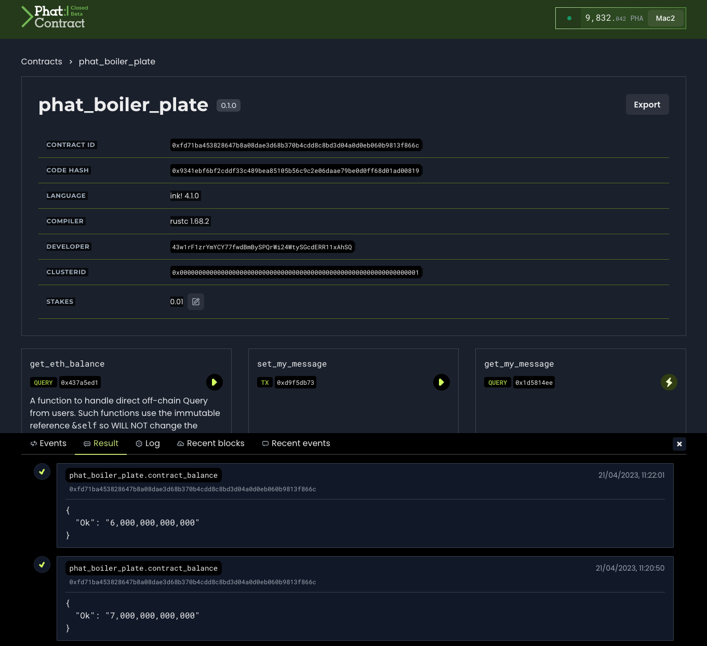
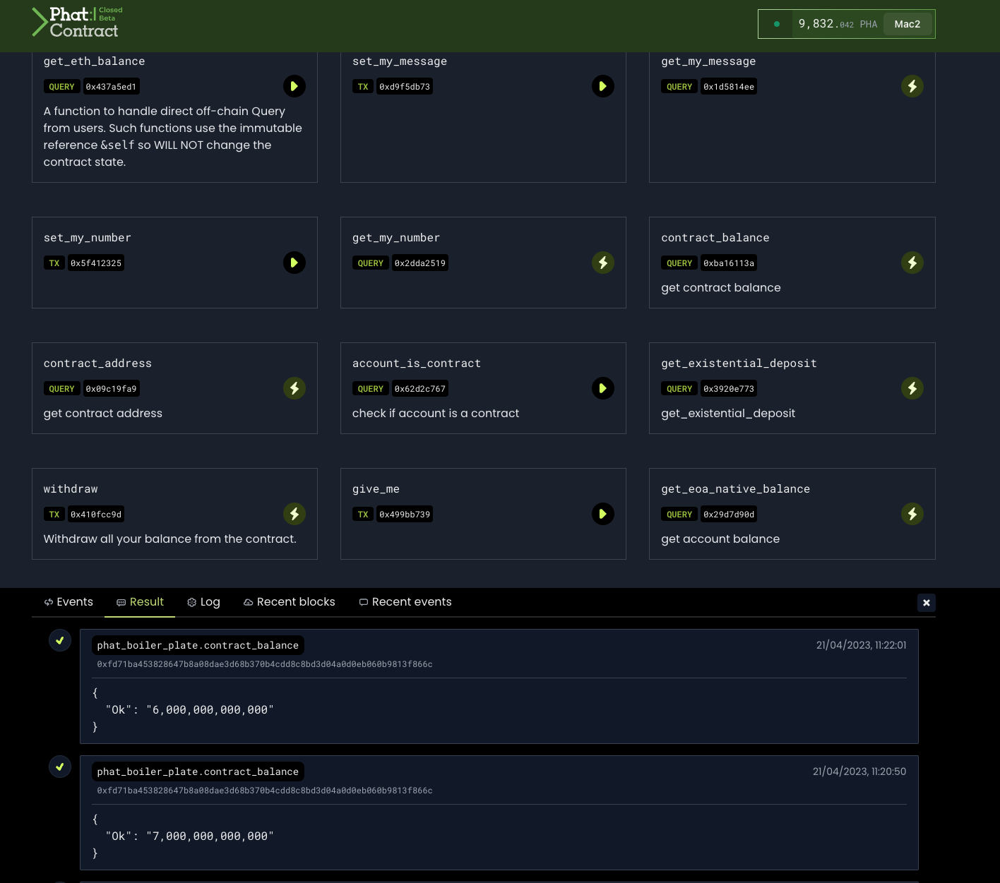

CONTRACT ID 0xfd71ba453828647b8a08dae3d68b370b4cdd8c8bd3d04a0d0eb060b9813f866c

CODE HASH 0x9341ebf6bf2cddf33c489bea85105b56c9c2e06daae79be0d0ff68d01ad00819

LANGUAGE ink! 4.1.0

COMPILER rustc 1.68.2

DEVELOPER 43w1rF1zrYmYCY77fwdBmBySPQrWi24WtySGcdERR11xAhSQ

CLUSTERID 0x0000000000000000000000000000000000000000000000000000000000000001

STAKES 0.01

<br>
<br>
<br>


<br>
<br>
<br>

<br>
<br>
<br>



<br>
<br>
<br>

<br>
<br>
<br>



<br>
<br>
<br>

# PROBLEM

The deployed Phat contract has a balance of 6 PHA

When the user calls give_me to withdraw for example 1 PHA the balance is deducted from Phat contract but

a) never emmits the relevant event on the explorer

b) user's account is not credited

c) phat contract balance updates to the decreased value as expected

<br>
<br>
<br>

# Hello World in Phat Contract


This contract shows the off-chain computation with native HTTP request support in Phat Contract from [Phala Network](https://phala.network/).

It receives the Ethereum accounts from users and reports the account balance by querying the Etherscan with its native HTTP request.

## Build

Setup the environment for Ink! contract compilation, then run

```bash
cargo +nightly contract build
```

## Test

To test your contract locally and see its output, run with

```bash
cargo +nightly test -- --nocapture
```
